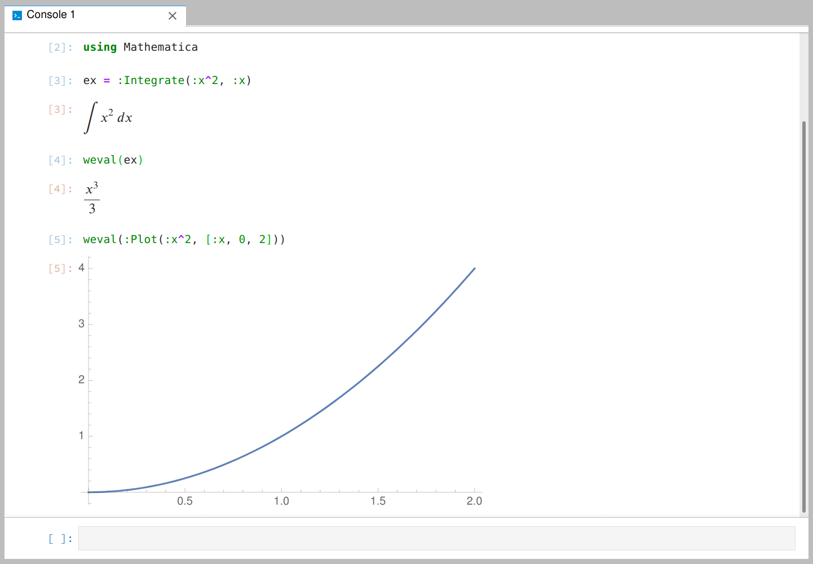

# Mathematica.jl

[](https://gitter.im/one-more-minute/Mathematica.jl)

The `Mathematica.jl` package provides an interface for using [Wolfram Mathematica™](http://www.wolfram.com/mathematica/) from the [Julia language](http://julialang.org). You cannot use `Mathematica.jl` without having purchased and installed a copy of Mathematica™ from [Wolfram Research](http://www.wolfram.com/). This package is available free of charge and in no way replaces or alters any functionality of Wolfram's Mathematica product.

The package provides is a no-hassle Julia interface to Mathematica.

```julia
Pkg.add("Mathematica")
````
Provided Mathematica is installed, You can easily build a Mathematica expression in Julia and use `weval` to evaluate it in Mathematica, and get the converted Julia type.

```julia
using Mathematica
weval(:Fibonacci(1000))
# => 43466557686937456435688527675040625802564660517371780402481729089536555417949051890403879840079255169295922593080322634775209689623239873322471161642996440906533187938298969649928516003704476137795166849228875
```
All Julia symbols are automatically converted to Mathematica symbols.

```julia
weval(:Integrate(:x^2, :x))
# => W"Times"(W"Rational"(1, 3), W"Power"(W"x", 3))

weval(:Integrate(:Log(:x), [:x,0,2]))
# => W"Plus"(-2, W"Log"(4))

weval(:N(ans))
# => -0.6137056388801094
```

Returned Mathematica data can be displayed as SVG or LaTeX, in supported frontend like Juno and IJulia:



Julia compatible data (e.g. lists, complex numbers etc.) will all be converted automatically, and you can extend the conversion to other types.

Finally, of course:
```julia
weval(:WolframAlpha("hi")) # =>
# 2×2 Array{Any,2}:
#  Any[Any["Input", 1], "Plaintext"]   "Hello."
#  Any[Any["Result", 1], "Plaintext"]  "Hello, human."

```

## Extending to custom datatypes

The Mathematica data expression `Head[x,y,z,...]` is represented in Julia as `WExpr(head = WSymbol(:Head), args = [x,y,z,...])`. We can extend `Mathematica.jl` to support custom types by overloading `Mathematica.buildexpr` and `Mathematica.getexpr`.

## Usage Issues

## Current Limitations / Planned Features
